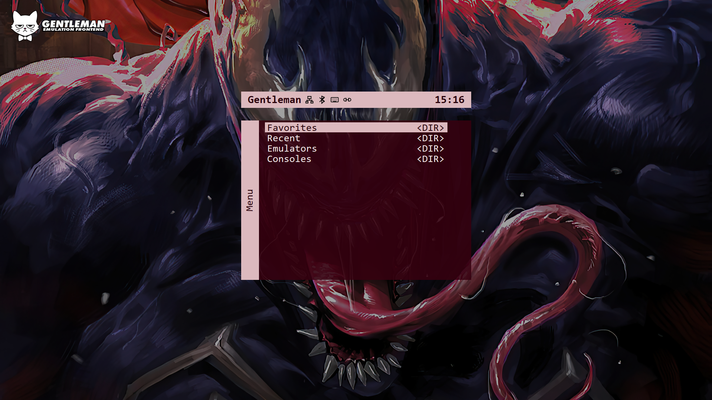

Gentleman is a MiSTer-inspired emulator frontend for PC.

The goal is to bring the simple, fast, menu-driven feel of the MiSTer interface to a PC-based emulator setup. Instead of using a database-heavy frontend, Gentleman builds its menu from a normal `menu/` folder. Folders become menu categories, and JSON files become launcher entries.

For example, `menu/Consoles/PS2.json` will make `Consoles` appear in the main menu, with `PS2` listed inside it.

Gentleman is designed to stay simple and transparent. Users can either create launcher JSON files manually, or create and edit them from inside the Gentleman menu. Each launcher points to an emulator executable, a ROM folder, supported file extensions, and optional launch arguments. RetroArch launchers can also define a specific core.

This project is experimental and not affiliated with the official MiSTer FPGA project.



## Platform Status

Gentleman is currently focused on Windows.

Linux support may be added later, but the current version should be treated as Windows-first. Some paths, file pickers, application handling, and packaging behavior are currently designed around Windows.

## Current Features

- MiSTer-inspired menu layout
- Folder-based menu structure
- JSON-based launcher entries
- In-app launcher creation
- In-app launcher editing
- Standalone emulator launcher support
- RetroArch launcher support with core selection
- Application launcher support
- Fast folder browsing without generating a database
- Recent games list
- Favorites list
- Favorite/unfavorite support
- Clear Recent and Clear Favorites actions
- Optional Favorites, Recent, and Emulators menu entries
- Automatic Emulators menu generated from launcher JSON files
- System selection using a predefined system list
- Wallpaper support through the Gentleman Menu
- Fullscreen support
- Fullscreen-at-launch setting
- Controller navigation support
- A/B and X/Y controller button swap settings
- API support for third-party apps and remote devices
- Active-session API reporting and close controls
- In-game OSD for running games, emulators, and applications
- Manual update check from the Gentleman Menu
- Optional external Gentleman Updater support
- API active indicator in the top bar
- App icon and logo support
- Logo can be enabled or disabled from Settings
- Gentleman Menu shows the local IP address and app version
- Built-in links for issue reports, feature requests, and project support

## Run

```bash
pip install -r requirements.txt
python main.py
```

## Updating

Gentleman can check GitHub for stable releases. The update check can be started manually from the Gentleman Menu, and the launch-time update check can be enabled or disabled from Settings.

The updater is optional and is released as a separate download. To use it, download `Gentleman-Updater-Windows-x86_64.zip`, extract `Gentleman-Updater.exe`, and place it next to `Gentleman.exe`. When an update is found, Gentleman can then start the updater for you.

The normal Gentleman release ZIP only contains `Gentleman.exe`. User folders such as `config/` and `menu/` are created on first launch and are not part of the release ZIP.

## Navigation

### Keyboard

- Up / Down: move 1 item
- Left / Right: move 10 items
- Enter / Space: select
- Esc / Backspace: go back
- Esc / Backspace on the home screen: open the Gentleman Menu
- F11: toggle fullscreen
- F5: refresh menu
- F: favorite or unfavorite selected game
- Ctrl + Alt + G: open the in-game OSD while a game, emulator, or application is running

### Controller

Controller support is available through `pygame`.

Default controller mapping:

- D-pad / left stick Up / Down: move 1 item
- D-pad / left stick Left / Right: move 10 items
- A: select
- B: back
- X: favorite or unfavorite selected game
- Start: select
- Back: back
- Hold L1 + L2 + L3 + R1 + R2 + R3 for one second: open the in-game OSD

The button layout can be adjusted from Settings:

- Swap A/B
- Swap X/Y

## Gentleman Menu

Press Backspace or Esc on the home screen to open the Gentleman Menu.

The local IP address and Gentleman version are shown at the top of this menu.

From here you can:

- Toggle Fullscreen
- Create Launcher
- Edit Launcher
- Refresh Menu
- Open Settings
- Open Wallpapers
- Report Issues & Requests
- Open Support the Project
- Check for Updates
- View About
- Exit

Report Issues & Requests opens the Gentleman GitHub issue templates.

Support the Project opens a submenu with links to Ko-fi and Buy Me a Coffee.

## Settings

The Settings menu currently includes:

- Fullscreen at Launch: Enabled / Disabled
- Emulators Menu: Enabled / Disabled
- Recent Menu: Enabled / Disabled
- Favorites Menu: Enabled / Disabled
- Logo: Enabled / Disabled
- Update Check at Launch: Enabled / Disabled
- API: Enabled / Disabled
- Swap A/B: Enabled / Disabled
- Swap X/Y: Enabled / Disabled
- In-Game OSD: Enabled / Disabled
- Clear Recent
- Clear Favorites

## Menu Structure

Gentleman scans the `menu/` folder automatically.

Example:

```text
menu/
├─ Consoles/
│  ├─ PS2.json
│  └─ GameCube.json
├─ Handhelds/
│  └─ GBA.json
└─ Apps/
   └─ Steam.json
```

This becomes:

```text
Consoles
Handhelds
Apps
```

Inside `Consoles`:

```text
PS2
GameCube
```

No manual registration is needed. If a JSON launcher exists inside the `menu/` folder, Gentleman can find it.

## Launcher Types

Gentleman currently supports three launcher types:

### Standalone Emulator

Used for emulators that launch games directly.

Example:

```json
{
  "type": "standalone",
  "emulator_name": "PCSX2",
  "system": "PS2",
  "emulator": "D:/Emulators/PCSX2/pcsx2-qt.exe",
  "rom_directory": "D:/Games/PS2",
  "extensions": [".iso", ".chd", ".cso"],
  "arguments": "-fullscreen \"{rom}\"",
  "recursive": true
}
```

### RetroArch

Used for RetroArch launchers with a specific core.

Example:

```json
{
  "type": "retroarch",
  "emulator_name": "RetroArch",
  "system": "SNES",
  "emulator": "D:/Emulators/RetroArch/retroarch.exe",
  "core": "D:/Emulators/RetroArch/cores/snes9x_libretro.dll",
  "rom_directory": "D:/Games/SNES",
  "extensions": [".sfc", ".smc", ".zip"],
  "arguments": "-L \"{core}\" \"{rom}\"",
  "recursive": true
}
```

### Application

Used for launching a single executable without a ROM folder.

Example:

```json
{
  "type": "application",
  "emulator_name": "Steam",
  "emulator": "C:/Program Files (x86)/Steam/steam.exe",
  "arguments": "",
  "recursive": true
}
```

## Arguments

Arguments control how Gentleman starts an emulator or application.

Gentleman supports placeholders:

```text
{rom}
```

The selected game path.

```text
{core}
```

The selected RetroArch core path.

Examples:

```text
"{rom}"
```

Launches the selected ROM directly.

```text
-fullscreen "{rom}"
```

Launches the selected ROM with a fullscreen argument.

```text
-L "{core}" "{rom}"
```

Launches RetroArch with the selected core and ROM.

Applications usually do not need arguments, so this field can often be left empty for Application launchers.

## Favorites and Recent

Gentleman can keep track of recently launched games and favorite games.

Recent games are added automatically when launched.

Favorites can be toggled with:

```text
F
```

or the mapped controller button.

Favorites and Recent can both be disabled from Settings. They can also be cleared from Settings with confirmation.

## Emulators Menu

Gentleman can automatically generate an Emulators entry on the main menu.

This is built from the emulator names used in launcher JSON files.

For example, launchers using:

```json
"emulator_name": "PCSX2"
```

will appear under the Emulators menu as:

```text
PCSX2
```

Selecting an emulator opens the emulator directly without a ROM.


## In-Game OSD

Gentleman includes an optional in-game OSD for running games, emulators, and applications.

The OSD displays the active game and emulator. For application launchers, it displays the application name.

Available actions include:

- Resume
- Close Game, Emulator, or Application
- Force Close Game, Emulator, or Application

Force Close includes a warning because it may interrupt save data or emulator writes.

The OSD can be opened with:

- `Ctrl + Alt + G` on a keyboard
- Hold `L1 + L2 + L3 + R1 + R2 + R3` for one second on a controller

While the OSD is open, the launched process is paused so OSD navigation does not also affect the running game.

The In-Game OSD setting is enabled by default and can be disabled from Settings.

## API

Gentleman includes an API for third-party apps.

The API allows external tools to:

- Retrieve available systems
- Retrieve games by system name
- Browse the Gentleman menu
- Browse games from a launcher
- Launch games
- Launch applications
- Retrieve recent games
- Retrieve favorites
- View the active game, emulator, or application
- Close the active session
- Force close the active session
- Bring Gentleman to the front

Third-party apps do not need to know which emulator is used, which JSON launcher exists, or which ROM folder is configured. They can ask Gentleman for systems and games directly.

See:

[API Documentation](API-Doc.docx)

## Notes

Gentleman is still experimental.

The current focus is to keep the app fast, simple, and transparent while building a MiSTer-inspired frontend experience for PC-based emulation.
